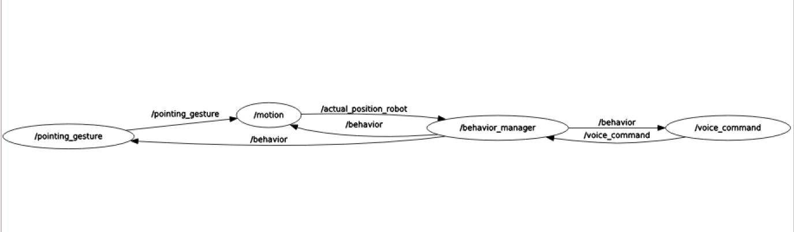

<!--
*** Thanks for checking out the Best-README-Template. If you have a suggestion
*** that would make this better, please fork the repo and create a pull request
*** or simply open an issue with the tag "enhancement".
*** Thanks again! Now go create something AMAZING! :D
***
***
***
*** To avoid retyping too much info. Do a search and replace for the following:
*** github_username, repo_name, twitter_handle, email, project_title, project_description
-->


<!-- PROJECT SHIELDS -->
<!--
*** I'm using markdown "reference style" links for readability.
*** Reference links are enclosed in brackets [ ] instead of parentheses ( ).
*** See the bottom of this document for the declaration of the reference variables
*** for contributors-url, forks-url, etc. This is an optional, concise syntax you may use.
*** https://www.markdownguide.org/basic-syntax/#reference-style-links
-->
<!-- [![Contributors][contributors-shield]][contributors-url]
[![Forks][forks-shield]][forks-url]
[![Stargazers][stars-shield]][stars-url]
[![Issues][issues-shield]][issues-url]
[![MIT License][license-shield]][license-url]
[![LinkedIn][linkedin-shield]][linkedin-url] -->


<!-- PROJECT LOGO -->
<br />
<p align="center">
  <a href="https://github.com/SerenaRoncagliolo/Exp_Robotics_Lab1">
    
  </a>

  <h3 align="center">Assignment 1 - Behavioural Architecture</h3>
<!-- togliere commenti
  <p align="center">
    This repository contains the first assignment of the experimental robotics laboratory course 2020 at the University of Genoa.
    <br />
    <a href="https://github.com/github_username/repo_name"><strong>Explore the docs »</strong></a>
    <br />
    <br />
    <a href="https://github.com/github_username/repo_name">View Demo</a>
    ·
    <a href="https://github.com/github_username/repo_name/issues">Report Bug</a>
    ·
    <a href="https://github.com/github_username/repo_name/issues">Request Feature</a>
  </p> -->
</p> 


<!-- TABLE OF CONTENTS -->
<details open="open">
  <summary><h2 style="display: inline-block">Table of Contents</h2></summary>
  <ol>
    <li>
      <a href="#about-the-project">About The Project</a>
      <ul>
        <li><a href="#built-with">Built With</a></li>
      </ul>
    </li>
    <li>
      <a href="#getting-started">Getting Started</a>
      <ul>
        <li><a href="#prerequisites">Prerequisites</a></li>
        <li><a href="#installation">Installation</a></li>
      </ul>
    </li>
    <li><a href="#usage">Usage</a></li>
    <li><a href="#roadmap">Roadmap</a></li>
    <li><a href="#contributing">Contributing</a></li>
    <li><a href="#license">License</a></li>
    <li><a href="#contact">Contact</a></li>
    <li><a href="#acknowledgements">Acknowledgements</a></li>
  </ol>
</details>


<!-- ABOUT THE PROJECT -->
## About The Project
The aim of this project is to implement control system for a robot simulating a pet, that interact with a human and moves in a discrete 2D environment.
The documentation of the project can be found in the folder _Documentation_
<p align="center">
<a>
    
</a>
</p>
The human can interact with the robot by using pointing gestures or spoken commands.
The robot can assume three behaviors:

* **Sleep**: the robot returns to a defined position inside the surrounding environment, it sleeps for some time and, finally, it wakes up and assumes normal behavior;
* **Play**: the robot approaches the person, it waits for a command to follow and it finally goes back to the person;
* **Normal**: the robot moves inside the environment.

<!--
## Built With

* []()
* []()
* []() -->

## Software  Architecture

### Components Architecture

<p align="center">
<a>
    
</a>
</p>


**Components**  
* **Voice Command Simulator**:  this component simulates the voice command "play" of the user; the command is published as a ROS message on the topic /voice_command;
* **Gesture Simulator**: this component simulates the goal position given by the user to the robot when in play mode; the position is published as a custom ROS message on the topic /pointing_gesture; in this simulation the user give the position at random intervals;
* **Behavior Command Manager**: this component simulate the Finite State Machine (FSM) and control the switching between the robot behaviors: Normal, Sleep and Play; this component publishes the new behavior as a ROS message on the topic /behavior; the other components subscribe to this topic and change function accordingly to the given behavior. The different behavior are explained later in this report.
* **Motion**: this component moves the robot using time delays to simulate it reaching the new positions, following the given behavior from the FSM. It makes use of a 2D map whose parameters are defined in a separate class; the map class is mainly used to save the updated values of the actual position everytime the behavior changes and a new function is executed. When in NORMAL state, it makes the robot moving randomly across the map; in the SLEEP state, the robot goes to the home position and rest theere until it goes back to normals; in the PLAY state, the robot goes first to the user, it waits for a goal position and then reaches it.
  
### State Machine

<p align="center">
<a>
    
</a>
</p>
 <ol>
<li> NORMAL BEHAVIOR: when the robot assumes this behavior, it starts moving randomly within the environment. While moving, the robot should listen to the voice commands, such as the _play_ command from the user which makes it switch to PLAY behavior. Otherwise, when it is moving, the sleep timer is activated and the robot should assume SLEEP behavior;</li>
<li> SLEEP BEHAVIOR: the robot is supposed to go to a predefined position which indicates "home position" and stop there for a giveb time interval. After a certain time, it should "wake up" and assume NORMAL behavior; </li>
<li> PLAY BEHAVIOR: the robot should perform the following actions:
  <ol>
  <li> Move to the location where the user is; </li>
  <li> Wait for the pointing gesture that specifies the new target to reach; </li>
  <li> Move to new target; </li>
  <li> Go back to the user and repeat the above actions; </li>
   </ol> 
  When a certaub number of games has been reached, the robot stops playing and returns to the NORMAL state. Otherwise, the sleeping timer is triggered, it goes into SLEEP behavior.
  
  </li>
 </ol>  

### ROS Topics
The following ROS topics has been defined:
* /behaviour → topic on which the current behaviour of the robot is published as a String by _behavior_manager.py_ and subscribed by all the components
* /voice_command → topic on which the command "start playing" given by the user is published as a String by _voice_command.py_ and subscribed by _behavior_manager.py_ 
* /pointing_gesture → topic on which the goal position of the robot is published by _pointing_gesture.py_ as an IntArray (which corresponds to have int[]) and subscribed by _motion.py_
* /actual_position_robot → topic on which the current position of the robot is published by _motion.py_ as an IntArray and subscribed by _behavior_manager.py_

### ROS Messages
The position of the robot within the map is describe by a x-axis coordinate and y-axis coordinate. To publish or subscribe the actual position of the robot when needed, we used the custom message IntArray:
  ```sh
  int32[] data
  ```

## Rqt_graphs 

<p align="center">
<a>
    
</a>
</p>

## Repository Organization

* **Documentation**: it contains the html and latex documentation of the repository generated using _Doxygen_;
* **Images**: it contains the images used in the _readme_ file;
* **launch**: it contains the launch file used to run the project;
* **msg**: it contains the custom message _IntArray_ used to publish and subscribe the position of the robot;
* **src**: it contains the python scripts describing the four components and the class Map2Dclass to represent the 2D map in which the robot moves.
 

<!-- GETTING STARTED
## Getting Started 

To get a local copy up and running follow these simple steps. -->

## Prerequisites
### Ros
This project is developed using [ROS Kinetic](http://wiki.ros.org/kinetic/Installation/Ubuntu). Follow [instructions](http://wiki.ros.org/kinetic/Installation/Ubuntu) for installation.

### Python
This project is developed using [Python3](https://www.python.org/downloads/). Follow [instructions](https://www.python.org/downloads/) for installation.

## Installation
This instructions assumes that you have installed **catkin**, if not it is necessary to follow the instruction at [catkin installation](https://wiki.ros.org/catkin#Installing_catkin). After installation source the environment:
 ```sh
 $ source /opt/ros/kinetic/setup.bash
 ```
1. Clone the repository
   ```sh
   git clone https://github.com/SerenaRoncagliolo/Exp_Robotics_Lab1.git
   ```
3. Enter the workspace Exp_Robotics_Lab1 and run:
   ```sh
   catkin_make
   source devel/setup.bash
   ```
4. Launch the project:
    ```sh
   roslaunch Exp_Robotics_Lab1 petbehavior.launch
   ```

<!-- USAGE EXAMPLES -->
## Usage

Here a short [video](https://github.com/github_username/repo_name/issues) showing the result of the project when running: 

## Working hypothesis and environment

The robot and the user are simulated by the described components:
* the voice command (simulated by _voice_command.py_) and the goal position (simulated by _pointing_gesture.py_) are given by ROS messages which are continuously sent at random time interval 
* the time taken to move within the environment is simulated by a random sleep time interval and the reaching of the given position is simply simulated by updating the actual position of the robot given the new coordinates;
* the 2D map is simulated using int values describing the total dimension and the specific coordinates such as _home position_, _user position_ and _robot position_.

### Systems features
The core feature of the system is the Finite State Machine (FSM) implemented using the ROS-independent Python library _SMACH_. The actual implementation represent the state machine diagram described above in this report.
The system components publish and subscribe information on specific topics at random time. Still, the system work correctly and the simulation is effective as shown in this [video](https://web.microsoftstream.com/video/84924c25-60f3-4475-a942-404971452487). 
When launching the system, all four components are activated, thus the _pointing_gesture.py_ and _voice_command.py_ start publishing goal position and _"play"_ command respectively. The system starts in _Normal_ behavior and it simulates the robot moving randomly by reaching given casual coordinates [x,y].
When the system is in _Normal_ behavior, it could transit to _Sleep_ or _Play_. At random time, the sleep timer is triggered and the system switches to _Sleep_ behavior, ti reaches the home position given, then it waits there some time to _wake up_ and go back to _Normal_ behavior. The system is back in _Normal_ state and it start moving randomly again. When the voice command _"play"_ is given, the system switches to _Play_ behavior: the robot moves to user position, it waits for the pointing gesture to be subscribed by _motion.py_, it reaches the given position and goes back to the user. After a random interval time, the FSM goes back to normal mode.

### Systems limitations

Some system transistions should be improved, since they are given by a random probability which is not optimal, since it is possible that the system keeps executing the same transition for a long time interval.
Furthermore, when the robot enters play mode, after reaching the user, sometimes it does not obtain a goal position, since it published at random time. Also, if the commands arrive when the robot can't handle them, the system will ignore them.

### Future work

The motion controll should be improved, a better solution would be to implement it as a ROS service. Furthermore, the robot motion should not be simulated using random interval time, but should be proportional to the actual distance the robot has to cover to obtain a more realistic behavior.
Another possibility is to take into account user commands in this architecture.


<!-- CONTRIBUTING 
## Contributing

Contributions are what make the open source community such an amazing place to be learn, inspire, and create. Any contributions you make are **greatly appreciated**.

1. Fork the Project
2. Create your Feature Branch (`git checkout -b feature/AmazingFeature`)
3. Commit your Changes (`git commit -m 'Add some AmazingFeature'`)
4. Push to the Branch (`git push origin feature/AmazingFeature`)
5. Open a Pull Request -->


<!-- LICENSE 
## License

Distributed under the MIT License. See `LICENSE` for more information. -->


<!-- CONTACT -->
## Contact

Serena Roncagliolo - S4233330@studenti.unige.it

Project Link: [https://github.com/SerenaRoncagliolo/Exp_Robotics_Lab1](https://github.com/SerenaRoncagliolo/Exp_Robotics_Lab1)


<!-- ACKNOWLEDGEMENTS
## Acknowledgements

* []()
* []()
* []()
 -->


<!-- MARKDOWN LINKS & IMAGES -->
<!-- https://www.markdownguide.org/basic-syntax/#reference-style-links 
[contributors-shield]: https://img.shields.io/github/contributors/github_username/repo.svg?style=for-the-badge
[contributors-url]: https://github.com/github_username/repo/graphs/contributors
[forks-shield]: https://img.shields.io/github/forks/github_username/repo.svg?style=for-the-badge
[forks-url]: https://github.com/github_username/repo/network/members
[stars-shield]: https://img.shields.io/github/stars/github_username/repo.svg?style=for-the-badge
[stars-url]: https://github.com/github_username/repo/stargazers
[issues-shield]: https://img.shields.io/github/issues/github_username/repo.svg?style=for-the-badge
[issues-url]: https://github.com/github_username/repo/issues
[license-shield]: https://img.shields.io/github/license/github_username/repo.svg?style=for-the-badge
[license-url]: https://github.com/github_username/repo/blob/master/LICENSE.txt
[linkedin-shield]: https://img.shields.io/badge/-LinkedIn-black.svg?style=for-the-badge&logo=linkedin&colorB=555
[linkedin-url]: https://linkedin.com/in/github_username
-->
