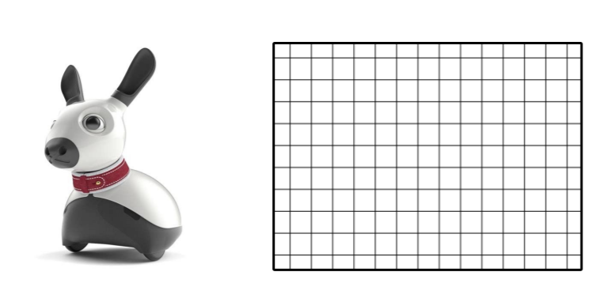
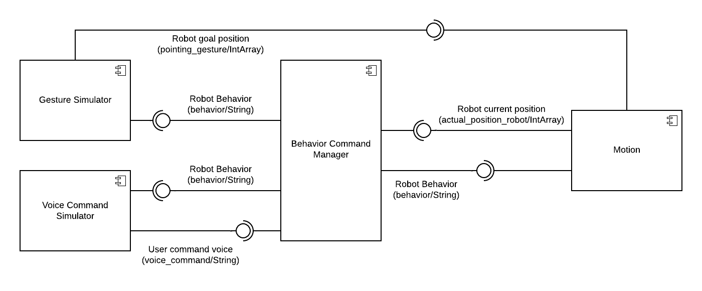
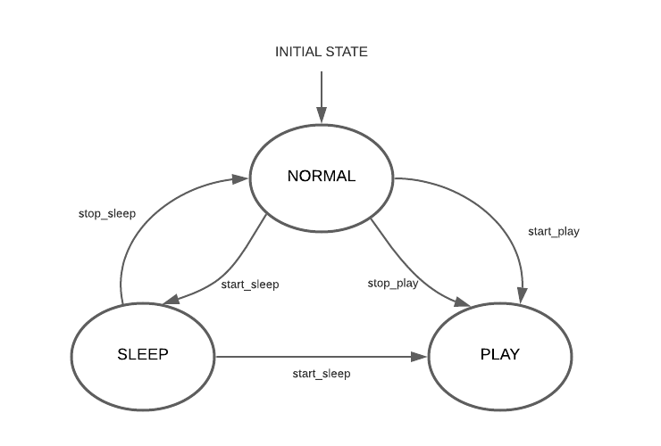

<!--
*** Thanks for checking out the Best-README-Template. If you have a suggestion
*** that would make this better, please fork the repo and create a pull request
*** or simply open an issue with the tag "enhancement".
*** Thanks again! Now go create something AMAZING! :D
***
***
***
*** To avoid retyping too much info. Do a search and replace for the following:
*** github_username, repo_name, twitter_handle, email, project_title, project_description
-->


<!-- PROJECT SHIELDS -->
<!--
*** I'm using markdown "reference style" links for readability.
*** Reference links are enclosed in brackets [ ] instead of parentheses ( ).
*** See the bottom of this document for the declaration of the reference variables
*** for contributors-url, forks-url, etc. This is an optional, concise syntax you may use.
*** https://www.markdownguide.org/basic-syntax/#reference-style-links
-->
<!-- [![Contributors][contributors-shield]][contributors-url]
[![Forks][forks-shield]][forks-url]
[![Stargazers][stars-shield]][stars-url]
[![Issues][issues-shield]][issues-url]
[![MIT License][license-shield]][license-url]
[![LinkedIn][linkedin-shield]][linkedin-url] -->


<!-- PROJECT LOGO -->
<br />
<p align="center">
  <a href="https://github.com/SerenaRoncagliolo/Exp_Robotics_Lab1">
    
  </a>

  <h3 align="center">Assignment 1 - Behavioural Architecture</h3>
<!-- togliere commenti
  <p align="center">
    This repository contains the first assignment of the experimental robotics laboratory course 2020 at the University of Genoa.
    <br />
    <a href="https://github.com/github_username/repo_name"><strong>Explore the docs »</strong></a>
    <br />
    <br />
    <a href="https://github.com/github_username/repo_name">View Demo</a>
    ·
    <a href="https://github.com/github_username/repo_name/issues">Report Bug</a>
    ·
    <a href="https://github.com/github_username/repo_name/issues">Request Feature</a>
  </p> -->
</p> 


<!-- TABLE OF CONTENTS -->
<details open="open">
  <summary><h2 style="display: inline-block">Table of Contents</h2></summary>
  <ol>
    <li>
      <a href="#about-the-project">About The Project</a>
      <ul>
        <li><a href="#built-with">Built With</a></li>
      </ul>
    </li>
    <li>
      <a href="#getting-started">Getting Started</a>
      <ul>
        <li><a href="#prerequisites">Prerequisites</a></li>
        <li><a href="#installation">Installation</a></li>
      </ul>
    </li>
    <li><a href="#usage">Usage</a></li>
    <li><a href="#roadmap">Roadmap</a></li>
    <li><a href="#contributing">Contributing</a></li>
    <li><a href="#license">License</a></li>
    <li><a href="#contact">Contact</a></li>
    <li><a href="#acknowledgements">Acknowledgements</a></li>
  </ol>
</details>


<!-- ABOUT THE PROJECT -->
## About The Project
The aim of this project is to implement control system for a robot simulating a pet, that interact with a human and moves in a discrete 2D environment.
The documentation of the project can be found in the folder _Documentation_
<p align="center">
<a>
    
</a>
</p>
The human can interact with the robot by using pointing gestures or spoken commands.
The robot can assume three behaviors:

* **sleep**: the robot returns to a defined position inside the surrounding environment, it sleeps for some time and, finally, it wakes up and assumes normal behavior;
* **play**: the robot approaches the person, it waits for a command to follow and it finally goes back to the person;
* **normal**: the robot moves inside the environment.

### Built With

* []()
* []()
* []()

## Software  Architecture

### Components Architecture

<p align="center">
<a>
    
</a>
</p>


**Components**  
* **Gesture Simulator**
* **Voice Command Simulator**  
* **Behavior Command Manager**
* **Motion**
  
### State Machine

<p align="center">
<a>
    
</a>
</p>
 <ol>
<li> NORMAL BEHAVIOR: when the robot assumes this behavior, it starts moving randomly within the environment. While moving, the robot should listen to the voice commands, such as the _play_ command from the user which makes it switch to PLAY behavior. Otherwise, when it is moving, the sleep timer is activated and the robot should assume SLEEP behavior;</li>
<li> SLEEP BEHAVIOR: the robot is supposed to go to a predefined position which indicates "home position" and stop there for a giveb time interval. After a certain time, it should "wake up" and assume NORMAL behavior; </li>
<li> PLAY BEHAVIOR: the robot should perform the following actions:
  <ol>
  <li> Move to the location where the user is; </li>
  <li> Wait for the pointing gesture that specifies the new target to reach; </li>
  <li> Move to new target; </li>
  <li> Go back to the user and repeat the above actions; </li>
   </ol> 
  When a certaub number of games has been reached, the robot stops playing and returns to the NORMAL state. Otherwise, the sleeping timer is triggered, it goes into SLEEP behavior.
  
  </li>
 </ol>  
 
<!-- GETTING STARTED -->
## Getting Started

To get a local copy up and running follow these simple steps.

### Prerequisites

This is an example of how to list things you need to use the software and how to install them.
* npm
  ```sh
  npm install npm@latest -g
  ```

### Installation

1. Clone the repo
   ```sh
   git clone https://github.com/github_username/repo_name.git
   ```
2. Install NPM packages
   ```sh
   npm install
   ```


<!-- USAGE EXAMPLES -->
## Usage

Use this space to show useful examples of how a project can be used. Additional screenshots, code examples and demos work well in this space. You may also link to more resources.

_For more examples, please refer to the [Documentation](https://example.com)_


<!-- ROADMAP 
## Roadmap

See the [open issues](https://github.com/github_username/repo_name/issues) for a list of proposed features (and known issues).-->


<!-- CONTRIBUTING 
## Contributing

Contributions are what make the open source community such an amazing place to be learn, inspire, and create. Any contributions you make are **greatly appreciated**.

1. Fork the Project
2. Create your Feature Branch (`git checkout -b feature/AmazingFeature`)
3. Commit your Changes (`git commit -m 'Add some AmazingFeature'`)
4. Push to the Branch (`git push origin feature/AmazingFeature`)
5. Open a Pull Request -->


<!-- LICENSE 
## License

Distributed under the MIT License. See `LICENSE` for more information. -->


<!-- CONTACT -->
## Contact

Serena Roncagliolo - S4233330@studenti.unige.it

Project Link: [https://github.com/SerenaRoncagliolo/Exp_Robotics_Lab1](https://github.com/SerenaRoncagliolo/Exp_Robotics_Lab1)


<!-- ACKNOWLEDGEMENTS -->
## Acknowledgements

* []()
* []()
* []()


<!-- MARKDOWN LINKS & IMAGES -->
<!-- https://www.markdownguide.org/basic-syntax/#reference-style-links -->
[contributors-shield]: https://img.shields.io/github/contributors/github_username/repo.svg?style=for-the-badge
[contributors-url]: https://github.com/github_username/repo/graphs/contributors
[forks-shield]: https://img.shields.io/github/forks/github_username/repo.svg?style=for-the-badge
[forks-url]: https://github.com/github_username/repo/network/members
[stars-shield]: https://img.shields.io/github/stars/github_username/repo.svg?style=for-the-badge
[stars-url]: https://github.com/github_username/repo/stargazers
[issues-shield]: https://img.shields.io/github/issues/github_username/repo.svg?style=for-the-badge
[issues-url]: https://github.com/github_username/repo/issues
[license-shield]: https://img.shields.io/github/license/github_username/repo.svg?style=for-the-badge
[license-url]: https://github.com/github_username/repo/blob/master/LICENSE.txt
[linkedin-shield]: https://img.shields.io/badge/-LinkedIn-black.svg?style=for-the-badge&logo=linkedin&colorB=555
[linkedin-url]: https://linkedin.com/in/github_username
